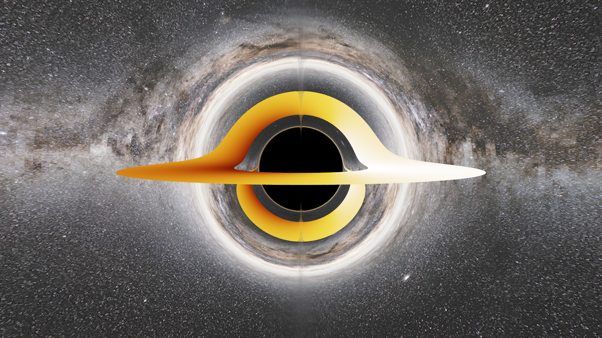
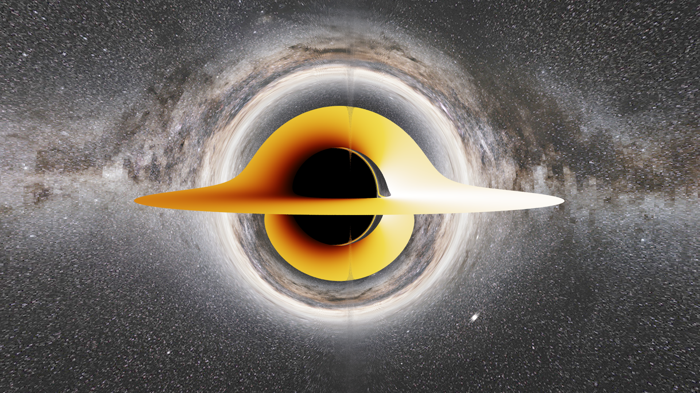

# Black Hole Live(ish) Simulation
Below is the physics and workings of the simulation if you're interested. Otherwise, play around with the simulation here: [super cool awesome simulation](https://h0sh1z0ra.github.io/bh_sim/). To move the camera, click anywhere in the frame and drag. You can also zoom; after every movement, just give it a sec to re-render.

## Background
This project is inspired by kavan's [_Simulating Black Holes in C++_](https://www.youtube.com/watch?v=8-B6ryuBkCM), minus the OpenGL. In addition to generating still images, I also used Emscripten to compile my C++ code to WebAssembly, so it can be viewed in a browser tab instead. The only downside is, on every camera movement, the simulation has to re-render the black hole, so it doesn't look quite as smooth as kavan's rendition.

Below are two images generated by the simulator, the top is Schwarzschild (0 spin), and Kerr (non-zero spin). The characteristic of Kerr black holes is that they exhibit frame-dragging - that is, one side appears flattened due to spacetime being dragged around by the rotation.

  

  

  

The accretion disks appear different colours, due to doppler beaming and gravitational redshift. Since the material in the disk orbits at close-to-light speeds, the material rotating towards the observer appears blueshifted and brighter, while the material rotating away appears redshifted and dimmer. Also, light climbing out of the potential well loses energy, so deeper into the hole means more redshift and dimmer.

## Inner Workings, Briefly
The ray-tracing and camera model is based on [_Ray Tracing in One Weekend_](https://raytracing.github.io/books/RayTracingInOneWeekend.html). It uses an adaptive 4th-order Runge-Kutta method to numerically integrate each ray's path through curved spacetime, until it is absorbed by the black hole, hits the accretion disk or escapes. The equations that define the black hole were derived and translated into C++ code using SymPy.

The radius of the shadow (the actual black part) was verified against the analytic Schwarzschild shadow radius of $\sqrt{27} M$ (but M = 1, so $\sqrt{27} \approx 5.196$), agreeing to within 6%. Also, the Hamiltonian that defines the photon trajectories, given by

  $$ H = \frac{1}{2}g^{\mu\nu}p_\mu p_\nu = 0 $$

is always 0, since photons have no mass. The Hamiltonian was checked numerically and stays $\sim 10^{-16}$ for each ray.

## Performance
The numerical integration by far dominates rendering time. By just including a fixed-step size implementation of RK4, each ray would take 5000+ steps. By making the rays take larger steps when they're further from the black hole, step count was eventually reduced to around 190 per ray, drastically improving render time.

Before the black hole, since the ray-tracing model is based on _Ray Tracing in One Weekend_, all the images were rendered on one thread. To use multiple, the image is rendered in parallel rows, and a buffer was added that holds the rows of the rendered image, and joins them together. This improved render time from 260 seconds initially to 37.5 seconds. Then, by using bounding-volume-hierarchy, the render time was improved further to ~7 seconds. In total, this yielded an improvement of 38 times. This mechanism is still used in rendering the still images, minus the BVH since the black hole and disk are defined with equations rather than being part of the scene, like in RTIOW.

Separately, images are written into binary format instead of ASCII PPM format, which significantly improves write time to the image file from 10 seconds to ~3 ms.

## Issues
When generating a still image (and to some extent on the browser), a noticeable vertical seam can be seen. I suspect this is due to the Boyer-Lindquist coordinate system I used, and it causes a singularity at the exact centre of the image, which is the polar axis ($\theta = 0$ and $\pi$), since BL coordinates divide by $\sin\theta$ which vanish at the poles.

## References
**Ray-tracing**: [Ray Tracing in One Weekend](https://raytracing.github.io/books/RayTracingInOneWeekend.html).  
Boyer, R. H. & Lindquist, R. W. (1967), Maximal analytic extension of the Kerr metric (for coordinate system)  
Bardeen, Press & Teukolsky (1972) — ISCO and photon orbits in Kerr (calculating the inner radius of the accretion disk)  

**Milky Way panorama**: ESO/S. Brunier, [CC BY 4.0](https://creativecommons.org/licenses/by/4.0/)  
**Image loading**: `stb_image.h` by [Sean Barrett](https://github.com/nothings/stb/blob/master/stb_image.h)  
**Fumino Nendroid**: on [meccha-japan.com](https://meccha-japan.com/en/chibi-style/14214-nendoroid-fumino-furuhashi-we-never-learn-bokuben.html)  
**Black Hole Pixel Art Icon**: by franky on [dinopixel.com](https://dinopixel.com/black-hole-pixel-art-58585)  
